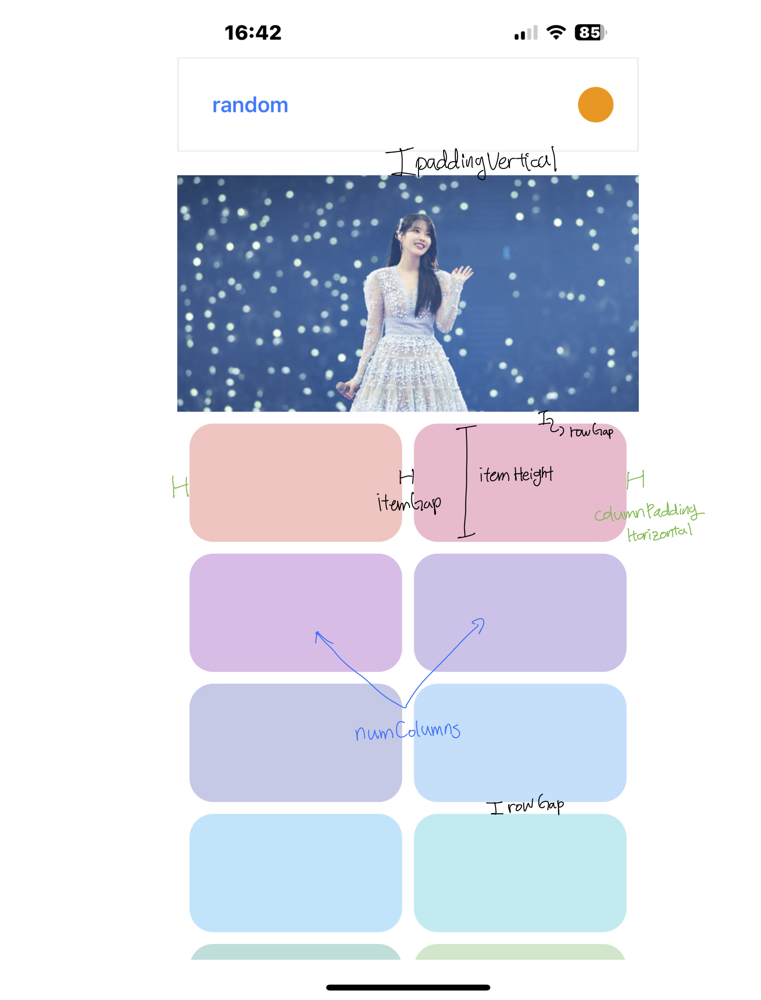

# WIP 👷‍♂️

# react-native-use-flatlist

make `<FlatList />` easier to use

## Installation

```sh
yarn add react-native-use-flatlist
```

## Features

- handles all the complex calculation for `getItemLayout`
- accurate scroll to index with `scrollToIndex`

## Usage

### Vertical FlatList

<video width="300" height="500" controls>
  <source src="https://github.com/jeongshin/react-native-use-flatlist/assets/64301935/9da72605-a150-4848-bee3-3285e9c88543" type="video/mp4">
</video>



```tsx
import { useVerticalFlatList } from 'react-native-use-flatlist';

// item should have fixed size
const ITEM_HEIGHT = 100;

const { ref, itemWidth, props, scrollToIndex, onHeaderLayout } =
  useVerticalFlatList<string>({
    paddingVertical: 20,
    columnPaddingHorizontal: 10,
    itemHeight: ITEM_HEIGHT,
    numColumns: 2,
    itemGap: 10,
    rowGap: 10,
  });

return (
  <FlatList
    ref={ref}
    data={data}
    {...props}
    ListHeaderComponent={<MyHeader onLayout={onHeaderLayout} />}
  />
);
```

### Horizontal FlatList

```tsx
import { useHorizontalFlatList } from 'react-native-use-flatlist';

const ITEM_WIDTH = 100;

const { ref, props, onHeaderLayout, scrollToIndex } =
  useHorizontalFlatList<ItemType>({
    itemWidth: ITEM_WIDTH,
    itemGap: 10,
    paddingHorizontal: 10,
  });

return (
  <FlatList
    ref={ref}
    data={data}
    {...props}
    ListHeaderComponent={<MyHeader onLayout={onHeaderLayout} />}
  />
);
```

## Contributing

See the [contributing guide](CONTRIBUTING.md) to learn how to contribute to the repository and the development workflow.

## License

MIT

---

Made with [create-react-native-library](https://github.com/callstack/react-native-builder-bob)
